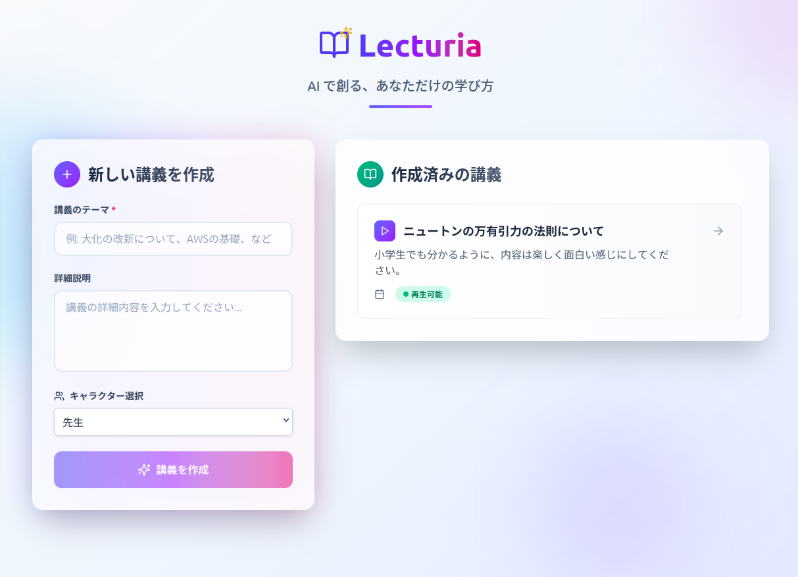
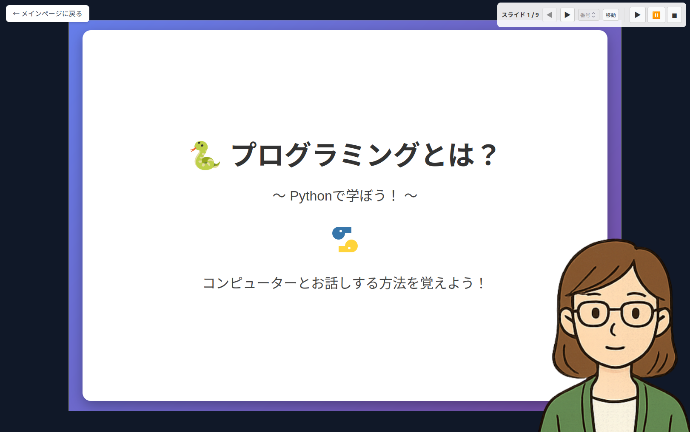
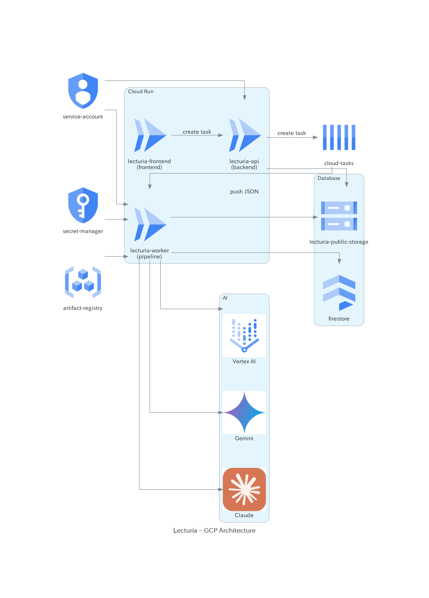

# 

<p align="center" style="font-size: 32px; font-weight: bold; font-style: italic;">
  <strong>"Your Learning, Your Way."</strong>
</p>

## Overview

Lecturia is a lecture generation tool that uses AI to generate lectures.
You can generate lectures by giving a topic and detailed content.




### Demo movie
https://www.youtube.com/watch?v=TZCaRyp9o2I

### Sample lecture demo
https://lecturia.vercel.app/

## Features

* Generate lecture slides by giving a topic and detailed content.
* Generate lecture scripts according to the slides.
* Generate audios according to the scripts.
* Animate characters talking on the slides.
* On the lecture, there are quizzes to check the understanding of the audience.

## Quick Start (Local)

First, launch the api server and seeder.

```bash
cd api
cp .env.example .env
# You need fill the following environment variables
# - ANTHROPIC_API_KEY
# - GOOGLE_API_KEY
# - BRAVE_API_KEY
# When you use Lecturia in local, you don't need to fill the Google Cloud's environment variables.
docker compose up -d
docker compose exec lecturia python examples/seeder.py
```

Next, launch the frontend server.

```bash
cd frontend
cp .env.example .env
pnpm install
pnpm dev
```

## Architecture (Google Cloud)


